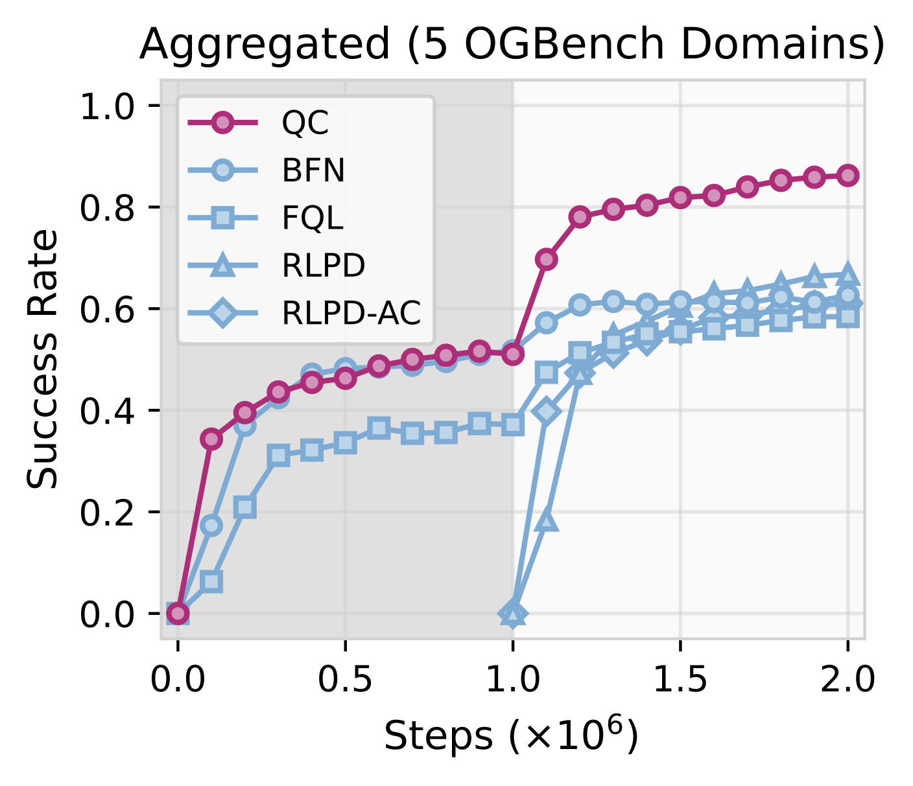

<div align="center">

# [Reinforcement Learning for Action Chunking](https://arxiv.org/abs/xxxx.xxxxx)

</div>

<p align="center">
  
  
</p>


## Installation
```bash
pip install -r requirements.txt
```


## Datasets
For robomimic, we assume the datasets are located at `~/.robomimic/lift/mh/low_dim_v15.hdf5`, `~/.robomimic/can/mh/low_dim_v15.hdf5`, and `~/.robomimic/square/mh/low_dim_v15.hdf5`. The datasets can be downloaded from https://robomimic.github.io/docs/datasets/robomimic_v0.1.html (under Method 2: Using Direct Download Links - Multi-Human (MH)).

For cube-quadruple, we use the 100M-size offline dataset. It can be downloaded from https://github.com/seohongpark/horizon-reduction via
```bash
wget -r -np -nH --cut-dirs=2 -A "*.npz" https://rail.eecs.berkeley.edu/datasets/ogbench/cube-quadruple-play-100m-v0/
```
and include this flag in the command line `--ogbench_dataset_dir=[realpath/to/your/cube-quadruple-play-100m-v0/]` to make sure it is using the 100M-size dataset.

## Reproducing paper results

We include the example command for all the methods we evaluate in our paper below. For `scene` and `puzzle-3x3` domains, use `--sparse=True`. 

```bash
# QC
MUJOCO_GL=egl python main.py --run_group=reproduce --agent.actor_type=best-of-n --agent.actor_num_samples=32 --env_name=cube-triple-play-singletask-task2-v0 --sparse=False --horizon_length=5

# BFN-n
MUJOCO_GL=egl python main.py --run_group=reproduce --agent.actor_type=best-of-n --agent.actor_num_samples=4 --env_name=cube-triple-play-singletask-task2-v0 --sparse=False --horizon_length=5 --agent.action_chunking=False

# BFN
MUJOCO_GL=egl python main.py --run_group=reproduce --agent.actor_type=best-of-n --agent.actor_num_samples=4 --env_name=cube-triple-play-singletask-task2-v0 --sparse=False --horizon_length=1

# QC-FQL
MUJOCO_GL=egl python main.py --run_group=reproduce --agent.alpha=100 --env_name=cube-triple-play-singletask-task2-v0 --sparse=False --horizon_length=5

# FQL-n
MUJOCO_GL=egl python main.py --run_group=reproduce --agent.alpha=100 --env_name=cube-triple-play-singletask-task2-v0 --sparse=False --horizon_length=5 --agent.action_chunking=False

# FQL
MUJOCO_GL=egl python main.py --run_group=reproduce --agent.alpha=100 --env_name=cube-triple-play-singletask-task2-v0 --sparse=False --horizon_length=1

# RLPD
MUJOCO_GL=egl python main_online.py --env_name=cube-triple-play-singletask-task2-v0 --sparse=False --horizon_length=1 

# RLPD-AC
MUJOCO_GL=egl python main_online.py --env_name=cube-triple-play-singletask-task2-v0 --sparse=False --horizon_length=5

# QC-RLPD
MUJOCO_GL=egl python main_online.py --env_name=cube-triple-play-singletask-task2-v0 --sparse=False --horizon_length=5 --agent.bc_alpha=0.01
```

```
@article{li2025qc,
  author = {Qiyang Li and Zhiyuan Zhou and Sergey Levine},
  title  = {Sample-Efficient Reinforcement Learning with Action Chunking},
  conference = {arXiv Pre-print},
  year = {2025},
  url = {http://arxiv.org/abs/xxxx.xxxxx},
}
```

## Acknowledgments
This codebase is built on top of [FQL](https://github.com/seohongpark/fql).
