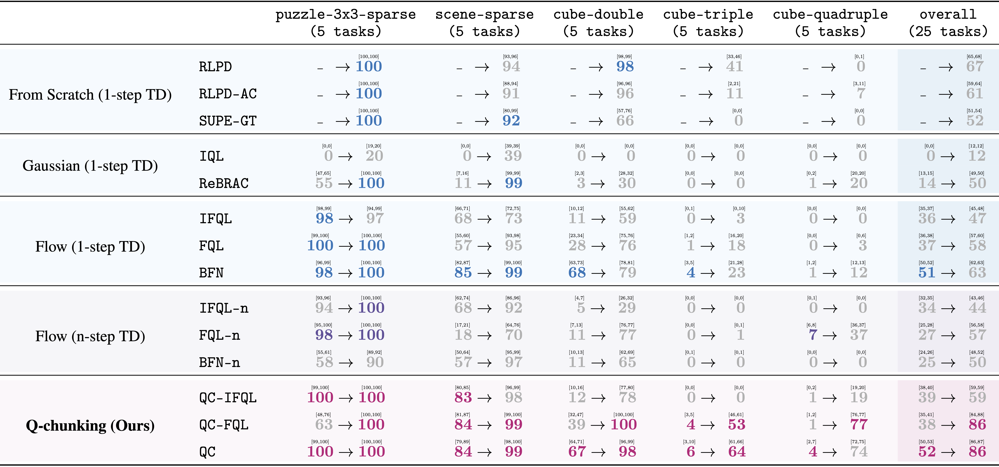

# Plot Data

We release the plot data (`ogbench-agg.pkl`, `ogbench-individual.pkl`, `robomimic-individual.pkl`) to facilitate future research. Each file is a dictionary keyed by `(task_name, method_name)` tuples. Each entry contains a nested dictionary with four arrays:
- `steps`: training steps (in millions), 
- `means`: mean success rate at each step,
- `ci_lows`, `ci_highs`: lower and upper bounds of the 95% bootstrap confidence interval with 5000 samples.
By default, all arrays contain 21 values (recorded every 100K steps from 0 to 2M). For online baselines (RLPD, RLPD-AC, QC-RLPD, SUPE-GT), the arrays contain only 11 values instead.

## Summary Table

## Full Table (individual task)

